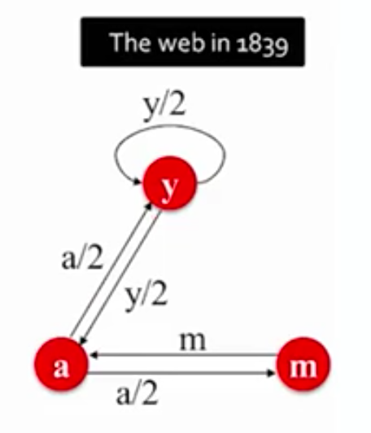

My notes/cheat sheet regarding [Chapter 5 of Stanford's Mining Of Massive Datasets course](http://mmds.org).

- A graph nas nodes and edges (aka arcs and links).
- There are directed and undirected graphs

---

- web can be seen as a graph of pages interconnected using hyperlinks
- initially the web pages were categorised by humans
- search engines are now used to find information on these pages
- there are trusted and untrusted web pages
- two challenges:
  1. how can we tell untrusted from trusted pages
  1. how to find the best pages/results for a given search keyword
- link analysis approaches: page rank, hubs and authorities, personalised page rank, spam detection
  - used in problems like this

---
  
- we can determine the importance of a node by the number of links pointing to it - page rank
- the "flow" formulation approach to calculate page rank
- links to a page interpreted as votes
- importance of a page as the sum of importance of its inbound links
- links from important pages count more 
- importance of a page split evenly trough its outgoing links
- equation for every page rank of every node: rank of node divided by number of outgoing links
- in a graph ranks are unknows and we need a system of equations to calculate the rank
  - there's a additional constraint added to this system of equations to make sure we have only one result: the sum of all ranks must be 1
- we can use the [gaussian elimition method](https://www.youtube.com/watch?v=2j5Ic2V7wq4) to solve the system of equations
- althouh it doesn't scale
- example of a graph

