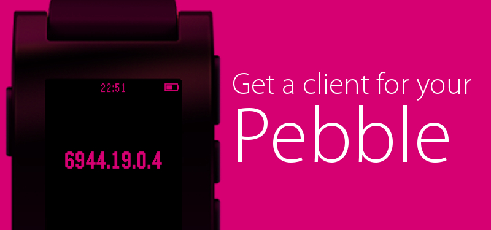

  

	<strong style="font-size:12vw;">
		
	</strong>

       

    

		
		<a href="karion.pbw" title="Get Karion's Simply.js client on Pebble Watch">
			</img>
		</a>
          
    

    

    

        
        <a href="karion.zip" title="Get Karion offline for your command line">
        	</img>
        </a>

    

